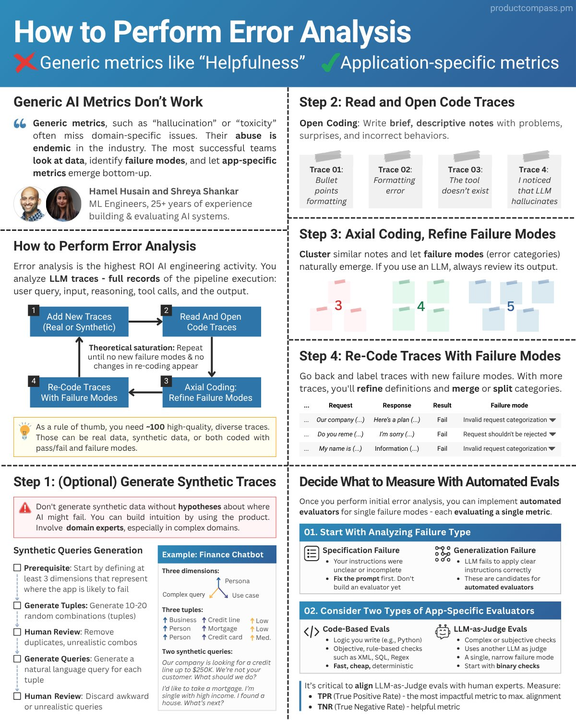

# Weave Error Analysis

A comprehensive error analysis platform for AI agents. Connect your agent, generate synthetic test queries, execute them in batches, and discover failure modes through automated and manual review—all powered by W&B Weave tracing.



## What It Does

This application helps you systematically improve your AI agents by:

1. **Registering your agent** with an AGENT_INFO.md document that describes its purpose, capabilities, tools, and testing dimensions
2. **Generating synthetic test queries** based on configurable dimensions (personas, scenarios, complexity)
3. **Executing batch runs** against your agent via the AG-UI protocol
4. **Reviewing traces** collected by Weave—manually add notes, or let the LLM auto-categorize failures
5. **Building a failure taxonomy** to track patterns and measure improvement over iterations

## Architecture

```
┌─────────────────────────────────────────────────────────────────────────┐
│                     YOUR ENVIRONMENT (External)                          │
│  ┌──────────────┐     ┌─────────────────┐     ┌────────────────────┐   │
│  │  Your Agent  │────▶│  AG-UI Endpoint │◀────│  Weave Tracing     │   │
│  │  (ADK, etc.) │     │  (localhost)    │     │  (OTEL)            │   │
│  └──────────────┘     └────────┬────────┘     └─────────┬──────────┘   │
└────────────────────────────────│─────────────────────────│─────────────┘
                                 │                         │
                                 ▼                         ▼
┌─────────────────────────────────────────────────────────────────────────┐
│                     ERROR ANALYSIS APPLICATION                           │
│                                                                          │
│  ┌─────────────┐    ┌─────────────┐    ┌─────────────┐                 │
│  │   Frontend  │◀──▶│   Backend   │◀──▶│  Weave API  │                 │
│  │  (Next.js)  │    │  (FastAPI)  │    │  (Traces)   │                 │
│  └─────────────┘    └──────┬──────┘    └─────────────┘                 │
│                            │                                             │
│                     ┌──────┴──────┐                                     │
│                     │   SQLite    │                                     │
│                     │ (taxonomy,  │                                     │
│                     │  batches)   │                                     │
│                     └─────────────┘                                     │
└─────────────────────────────────────────────────────────────────────────┘
```

## Features

### 🤖 Agent Registry
Register external agents by providing:
- **Endpoint URL**: Your AG-UI compatible endpoint (e.g., `http://localhost:8001`)
- **AGENT_INFO.md**: A structured document describing your agent's purpose, tools, capabilities, limitations, and testing dimensions

### 🧪 Synthetic Data Generation
Generate realistic test queries based on dimensions defined in your AGENT_INFO:
- **Personas**: first_time_user, power_user, frustrated_customer, etc.
- **Scenarios**: pricing_inquiry, refund_request, technical_issue, etc.
- **Complexity**: simple, multi_step, edge_case, adversarial

Uses LLM to convert dimension tuples into natural-sounding queries.

### ▶️ Batch Execution
Run synthetic query batches against your connected agent:
- Real-time progress with streaming updates
- Automatic trace linking via Weave
- Success/failure tracking per query
- Re-run failed queries option

### 📋 Session Review
Browse and analyze Weave traces:
- View full conversation threads
- Add notes and observations
- Mark traces as reviewed
- Filter by batch to review specific runs

### 🏷️ Failure Taxonomy
Categorize failure modes discovered during review:
- LLM-assisted auto-categorization using the FAILS pipeline
- Manual category management
- Saturation tracking across categories
- Export failure reports

### 🔄 Auto Review
Automated trace analysis powered by LLM:
- Uses AGENT_INFO context (capabilities, limitations, success criteria)
- Integrates with FAILS categorization pipeline
- Generates actionable failure reports

### ⚙️ Settings
Configure the application through the UI:
- **LLM Configuration**: Set your LLM provider (OpenAI, Anthropic, Google), model, and API key
- **Weave Configuration**: Set your W&B API key, entity, and project
- **Auto-Review Settings**: Configure the model and concurrency for automated reviews
- Test connections directly from the Settings tab

## Components

| Directory | Description |
|-----------|-------------|
| `frontend/` | Next.js app with tabs: Sessions, Taxonomy, Agents, Synthetic, Runs, Settings |
| `backend/` | FastAPI service handling Weave queries, AG-UI client, synthetic generation |
| `agent/` | Demo TaskFlow Support Agent (example—replace with your own agent) |

## Setup

### Prerequisites
- Python 3.10+
- Node.js 18+ and pnpm
- W&B account with Weave project

### Configuration

You have two options for configuring API keys:

**Option 1: Via the Settings UI (Recommended)**
1. Start the application
2. Go to the **Settings** tab
3. Enter your LLM and Weave credentials
4. Click **Save Settings**

**Option 2: Via Environment Variables**

Create a `.env` file in the root directory:

```bash
# W&B / Weave (required for trace retrieval)
WANDB_API_KEY=your_wandb_api_key
WANDB_ENTITY=your_wandb_username
WEAVE_PROJECT=your_weave_project_name

# LLM (required for synthetic generation, auto-review)
OPENAI_API_KEY=your_openai_key
```

Settings configured via the UI take priority over environment variables.

**Frontend Environment Variables**

For deployment, create `frontend/.env.local` to configure the backend URL for SSE streaming:

```bash
# Full backend URL (for production deployments)
NEXT_PUBLIC_BACKEND_URL=https://api.yourdomain.com

# Or just change the port (keeps hostname dynamic)
NEXT_PUBLIC_BACKEND_PORT=8000
```

**Backend CORS Configuration**

For production, set allowed origins for SSE streaming. Create `backend/.env`:

```bash
# Comma-separated list of allowed frontend origins
CORS_ORIGINS=https://app.yourdomain.com,https://www.yourdomain.com

# Or allow all origins (for development/testing only)
CORS_ALLOW_ALL=true
```

### Quick Start

```bash
# 1. Setup all components
./run.sh setup

# 2. Start backend (Terminal 1)
./run.sh backend

# 3. Start frontend (Terminal 2)
./run.sh frontend

# 4. Open http://localhost:3000
```

### Manual Setup

```bash
# Backend
cd backend
python -m venv .venv && source .venv/bin/activate
pip install -r requirements.txt
uvicorn main:app --reload --port 8000

# Frontend
cd frontend
pnpm install
pnpm dev
```

## Connecting Your Agent

Your agent must expose an AG-UI compatible endpoint. Here's how:

### Option 1: Google ADK with AG-UI Adapter

```python
from ag_ui_adk import create_app
from my_agent import create_agent

agent = create_agent()
app = create_app(agent=agent)

# Run with: uvicorn my_server:app --port 8001
```

### Option 2: Manual AG-UI Implementation

Implement these endpoints:
- `GET /health` - Health check
- `POST /` - Accept message, stream SSE events

Events to emit: `RUN_STARTED`, `TEXT_MESSAGE_CHUNK`, `TOOL_CALL_START`, `TOOL_CALL_ARGS`, `TOOL_CALL_END`, `RUN_FINISHED`

### Creating AGENT_INFO.md

Your agent documentation should include:

```markdown
# AGENT_INFO.md

## Agent Metadata
- **Name**: Your Agent Name
- **Version**: 1.0.0
- **Type**: Customer Support / Assistant / etc.

## Purpose & Scope
What your agent does and who it serves.

### Capabilities
1. What it can do
2. Available tools

### Limitations
- What it cannot do

## Testing Dimensions

### personas
- first_time_user: Description
- power_user: Description

### scenarios
- common_request: Description
- edge_case: Description

### complexity
- simple: One-step interaction
- multi_step: Requires multiple tool calls

## Success Criteria
1. Expected behaviors
2. Quality standards
```

See `agent/AGENT_INFO.md` for a complete example.

## Workflow

```
┌────────────┐   ┌────────────┐   ┌────────────┐   ┌────────────┐   ┌────────────┐
│  Register  │──▶│  Generate  │──▶│   Execute  │──▶│   Review   │──▶│  Taxonomy  │
│   Agent    │   │  Queries   │   │   Batch    │   │   Traces   │   │  Failures  │
└────────────┘   └────────────┘   └────────────┘   └────────────┘   └────────────┘
     │                                                                    │
     │                                                                    │
     └──────────────────────────────────────────────────────────────────▶│
                              Fix agent, iterate                          ▼
                                                                   Track improvement
```

1. **Settings Tab**: Configure your LLM and Weave API keys (first time setup)
2. **Agents Tab**: Register your agent with endpoint URL and AGENT_INFO
3. **Synthetic Tab**: Import dimensions, configure batch size, generate queries
4. **Runs Tab**: Execute batches, watch real-time progress
5. **Sessions Tab**: Review traces, add notes, filter by batch
6. **Taxonomy Tab**: Categorize failures, run auto-review, export reports

## API Endpoints

| Endpoint | Description |
|----------|-------------|
| `GET /api/threads` | List conversation threads from Weave |
| `GET /api/threads/{id}/traces` | Get traces for a thread |
| `POST /api/agents` | Register a new agent |
| `POST /api/agents/{id}/run` | Run a query against an agent (SSE) |
| `POST /api/synthetic/batches` | Create a synthetic batch |
| `POST /api/synthetic/batches/{id}/execute` | Execute a batch (SSE) |
| `POST /api/synthetic/batches/{id}/auto-review` | Run automated review |
| `POST /api/categorize` | LLM-categorize failure modes |
| `GET /api/settings/grouped` | Get all settings by category |
| `PUT /api/settings/{key}` | Update a setting |
| `POST /api/settings/test-llm` | Test LLM connection |
| `POST /api/settings/test-weave` | Test Weave connection |

## Demo Agent

The `agent/` directory contains a TaskFlow Customer Support Agent built with Google ADK. It demonstrates:
- Tool usage (get_product_info, check_subscription_status, process_refund_request)
- AG-UI endpoint implementation
- AGENT_INFO.md documentation format

Run it with:
```bash
cd agent
source .venv/bin/activate
python agui_server.py  # Starts on port 8001
```

## Tech Stack

**Backend**
- FastAPI
- Weave SDK
- LiteLLM (for LLM calls)
- SQLite (local state)
- httpx (AG-UI client)

**Frontend**
- Next.js 14
- React 18
- Tailwind CSS
- Lucide icons

## License

MIT
